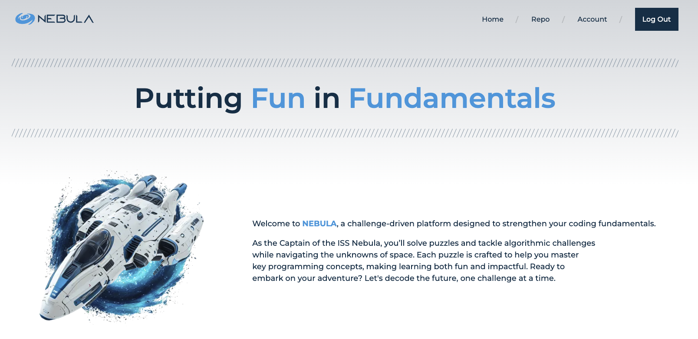

# 

Welcome to **Nebula**, a challenge-driven platform designed to strengthen your coding fundamentals.

As the Captain of the ISS Nebula, you’ll solve puzzles and tackle algorithmic challenges while navigating the unknowns
of space. Each puzzle is crafted to help you master key programming concepts, making learning both fun and impactful.
Ready to embark on your adventure? Let's decode the future, one challenge at a time.

  

